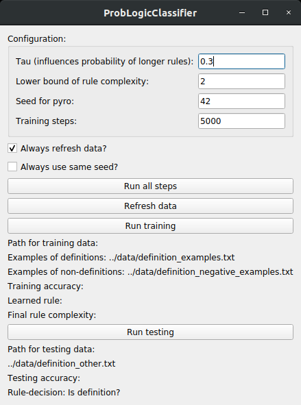

# ProbLogicClassifier



An experimental application for generating propositional logic expressions using probabilistic programming to classify sentences containing definitions.

Pyro is used for the probabilistic programming and PyQt for the gui. 

## How To 

1. Download the repo and open the folder in the command line

2. Install dependencies:
```bash
pip install -r requirements.txt
```

3. (Optional) Modify data 
* all data points are separated by a new line on Linux
* definition_examples.txt contains defintion training examples
* definition_negative_examples.txt contains training examples of non-definitions
* definition_other.txt contains testing data
* testing accuracy is calculated by assuming that the first half of the testing data is definitions and the second half is not

4. Go to the src folder and execute gui.py
```bash
cd src/
python3 gui.py
```

### Configuration

* Tau is the probability that while creating the logic expression the program decides to expand the current rule. Increasing this can lead to much longer rules and also takes much longer.
* Lower bound of rule complexity: Rules with a particular low complexity like 1 (e.g. that a sentence has to contain exactly one "is" to be a definition) are obviously not fit for further usage. Increasing this also increases the lenght of the rule. Complexity is calculated by adding 1 for each predicate and 2 for either conjunction or disjunction.
* Seed for Pyro: influences the kind of rules we will generate. By always using the same seed we can make the pseudo random process reproducible.
* Training steps: how many random rules we generate and test.

## Motivation

Propositional logic provides a lightweight way to represent models. By using probabilistic programming we can find these models in a moderate amount of time, allowing for easy updating with changing data and usage of the personalized models in assisting users (e.g. in finding definitions for the creation of corresponding flashcards). 

Inspiration: [probmods.org/chapters/lot-learning.html](probmods.org/chapters/lot-learning.html)

### Results

* As expected, classification of definitions is hugely dependant on the training and test data
* By using different parameters and data this can be tuned
* The sample dataset shows that if we are in a highly specialized/personalized environment, we can at least use the resulting model to give us suggestions 

## Components

* Model: Learn a rule to identify defintion-sentences
* Classification: Use rule to classify definitions

### Learn what a definition is 

* Extract feature representation (matrix of word counts, e.g. the amount of the word "Word" in the sentence x would be accessed like this: x["Word"]) from sentences via sklearn's [CountVectorizer](https://scikit-learn.org/stable/modules/generated/sklearn.feature_extraction.text.CountVectorizer.html) 
* Sample propositional logic expressions based on its ability to explain the training sentences
* Use rejection sampling to find expression that classifies the test data best

### Classify sentences

* Use logic expression to classify incoming sentences
* Present sentences to user for approval and identification of defined object
